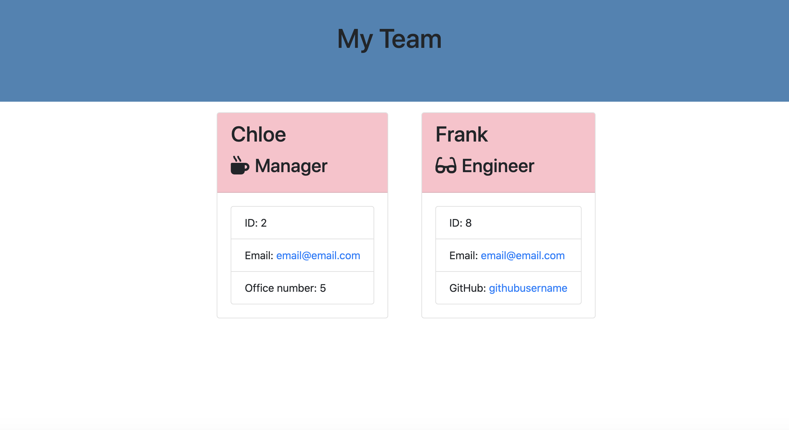
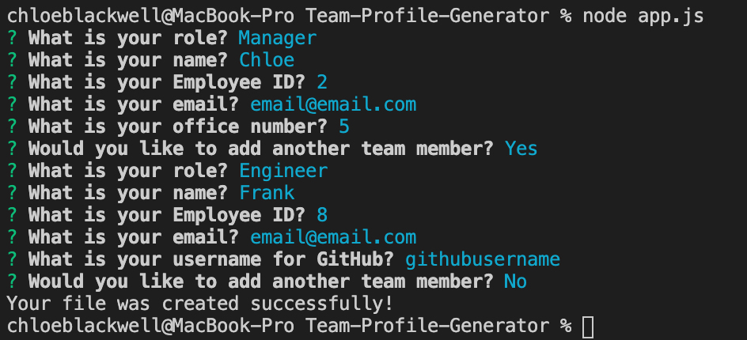

# Team-Profile-Generator

For this assignment, we were tasked to make a software engineering team generator command line application. The application prompts the user for information about their team and generates it to a HTML file.

## Contents

This application consists of 1 main page, app.js, a lib folder that contains all the different tyep of employee information, output folder that has the team.html file, templates which has the html templates inside, tests folder which contains all the tests and the package.json files. It will also have an images folder that the screenshots of this README will be.

## User Story

As a manager 
I want to generate a webpage that displays my team's basic info 
so that I have quick access to emails and GitHub profiles

## Screenshots & Video

<a href="https://drive.google.com/file/d/1cjMxjKj2Lgk7M-di8gL-5mtbVMeRzLqY/view?usp=sharing">Demo</a>

## Installation

To use this application, first run npm install to install the following package that is a dependancy which is stated in the package.json file.

- inquirer

The application itself can be invoked with the following command.

node app.js

## Tests

The tests that were run during this assignment are in the tests folder within the repository.

## Built With

- VS Code (https://code.visualstudio.com/)
- Terminal

## License

This application does not have a license.

## Author

Chloe Blackwell 
Email: chloeblackwell2@hotmail.com
